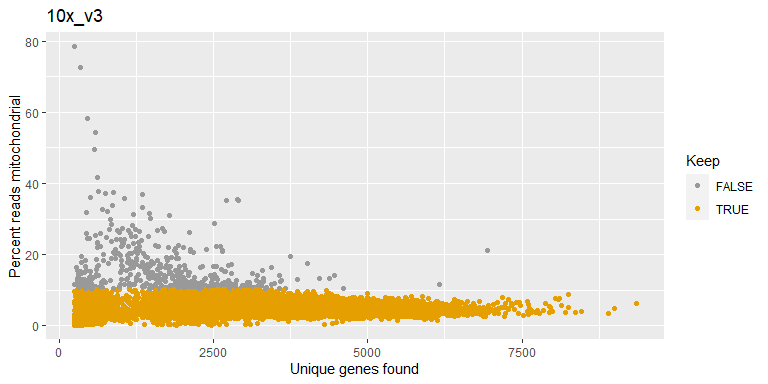
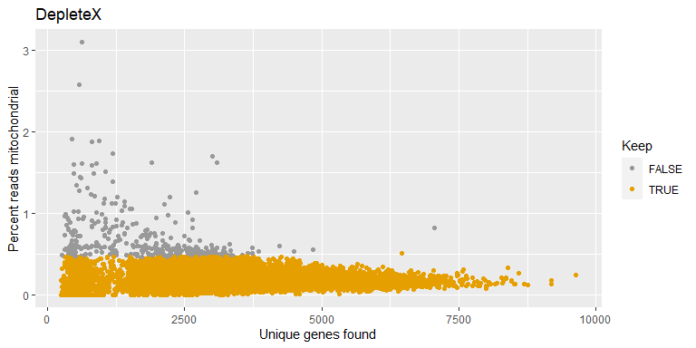
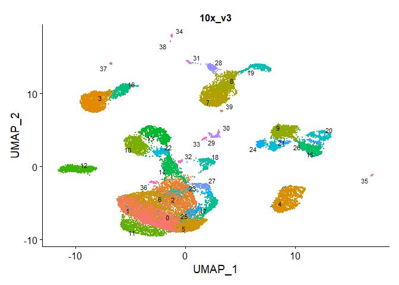
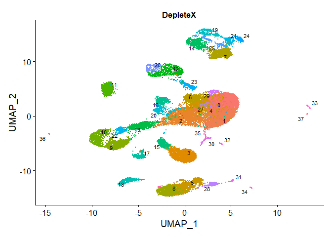
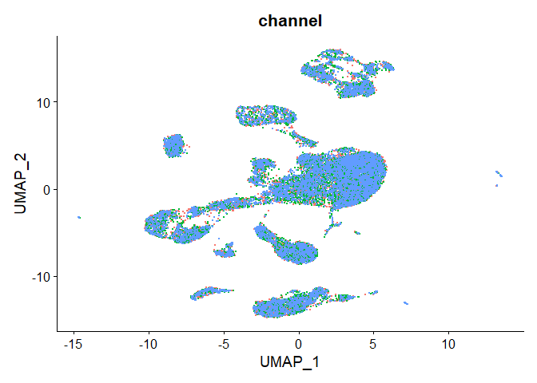

Analysis with 10x Data Using DepleteX (Cell Ranger \>= v7)
================
2023-09-04

- [1 Setup the seurat object](#1-setup-the-seurat-object)
- [2 Data pre-processing and QC
  workflow](#2-data-pre-processing-and-qc-workflow)
  - [2.1 Filtering low-quality cells](#21-filtering-low-quality-cells)
    - [2.1.1 Filtering cells with low
      throughput](#211-filtering-cells-with-low-throughput)
    - [2.1.2 Filtering compromised
      cells](#212-filtering-compromised-cells)
    - [2.1.3 Filtering low-complexity
      cells](#213-filtering-low-complexity-cells)
    - [2.1.4 Doublet filtering](#214-doublet-filtering)
  - [2.2 Cell cycle evaluation](#22-cell-cycle-evaluation)
  - [2.3 Modeling dropouts for significantly variable
    genes](#23-modeling-dropouts-for-significantly-variable-genes)
- [3 Cell clustering using SCTransform
  workflow](#3-cell-clustering-using-sctransform-workflow)

# 1 Setup the seurat object

We are going to use the Seurat toolkit to perform all subsequent
downstream analysis for this tutorial.

We start by reading the data using the Read10x_h5() function which reads
the .h5 file containing the Seurat inputs generated by CellRanger and
generates a count matrix. We next use the count matrix to create a
seurat object.

First we will load all necessary packages

``` r
x <- c("Seurat", "dplyr", "patchwork", "warrenlabSC", "ggplot2", "ggpubr", "rstatix", "plotrix", "ggExtra", "cowplot", "tidyr", "purrr", "scuttle")

# Use lapply with suppressPackageStartupMessages and library
invisible(lapply(x, function(pkg) suppressPackageStartupMessages(library(pkg, character.only = TRUE))))
```

``` r
#create matrix
mtx <- Read10X_h5("cellranger_aggr_pbmc/control_depletex_pbmc_triplicates.h5")
```

We are next going to create the Seurat object. We used Cell Ranger
Aggregate to combine ~30K cells processed with the 10x v3.1 workflow and
~30k cells processed with DepleteX so that we are working with a single
.h5 file. Alternatively, you can load in each dataset separately if you
did not use Cell Ranger Aggregate. Later, we will use data-driven
techniques to determine appropriate thresholds for removing low-quality
cells.

``` r
#create the seurat object
so <- CreateSeuratObject(mtx, project = "PBMC")
```

We can also add the metadata that was used in Cell Ranger Aggregate to
the Seurat object

``` r
#import meta data
meta_data <- read.csv("cellranger_aggr_pbmc/aggregation.csv")
so <- add.meta.data(seurat = so, meta.data = meta_data)

#we can remove the raw matrix which is now stored in the Seurat object to save some memory
rm(mtx)
```

Next we calculate some key QC metrics to verify DepleteX depletion
efficiency

``` r
#calculate percent mito content 
so <- PercentageFeatureSet(so, pattern = "MT-", col.name = 'percent.mt')

#calculate percent ribo
so <- PercentageFeatureSet(so, pattern = "^RP[SL][[:digit:]]|^RPLP[[:digit:]]|^RPSA", col.name = 'percent.rb')

#create regex for target list
nvg <- read.delim("targets_files/nvg_genes.txt", header = F)
nvg <- nvg$V1
nvg <- paste0("^", nvg, "$", collapse = "|")

#percent nvg genes
so <- PercentageFeatureSet(so, pattern = nvg, col.name = 'percent.nvg')
```

Now we can use a boxplot to visualize how well we are removing UMIs
associated with certain targeted sets, namely mitochondrial, ribosomal,
and NVG

``` r
#select columns for plotting
selected_columns <- c("percent.mt", "percent.rb", "percent.nvg", "depletion")

#create temp data frame
temp <- so@meta.data %>% select(all_of(selected_columns))

# Reshape the data to a longer format
temp_long <- temp %>%
  pivot_longer(cols = c(percent.mt, percent.rb, percent.nvg),
               names_to = "variable", values_to = "value")

# Calculate the median values for each variable by "depletion" group
medians <- temp %>%
  group_by(depletion) %>%
  summarise(across(c("percent.mt", "percent.rb", "percent.nvg"), median))

# Create a data frame for geom_text() annotations
text_df <- medians %>%
  pivot_longer(cols = c("percent.mt", "percent.rb", "percent.nvg"),
               names_to = "variable", values_to = "median_value")

# Create the ggboxplot and add median value annotations
ggboxplot(data = temp_long, x = "depletion", y = "value", color = "variable", palette = "npg",bxp.errorbar = T, bxp.errorbar.width = 0.2, outlier.shape = NA, facet.by = "variable", order = c("10x_v3","DepleteX")) + 
  ylab("% UMIs/cell") + 
  theme(axis.text.x = element_text(angle = 45, hjust = 1), axis.title.x = element_blank(), legend.title = element_blank()) +
    geom_text(data = text_df, aes(depletion, 65, label = round(median_value, 1)), 
              position = position_dodge(width = 0.8), size = 8, vjust = -0.5)
```

<!-- -->

``` r
line_of_fit <- function(df, x, y, targets = NULL) {
  x <- enquo(x)
  y <- enquo(y)
  
  ggplot(df, aes(x = !!x, y = !!y)) + 
    geom_point(
      aes(
        color = ifelse(!!y > !!x, "Above Unity",
                       ifelse(rownames(df) %in% targets, "Targeted Genes", "Below Unity"))
      ),
      size = 1
    ) +
    geom_abline(intercept = 0, slope = 1, linetype = "dashed", color = "black", linewidth = 1) +
    scale_color_manual(
      values = c(
        "Above Unity" = "#E7B800",
        "Below Unity" = "#00AFBB",
        "Targeted Genes" = "#FF0000"  # Adjust the color as needed
      )
    ) +
    labs(color = "Gene Position") +
    stat_cor(
      method = "pearson",
      aes(label = paste(..rr.label.., ..p.label.., sep = "~`,`~")),
      label.x = 0.1,
      label.y = 5,
      r.digits = 3
    ) +
    theme_half_open()
}

#aggregate the expression of all replicates
agg <- AggregateExpression(so, group.by = 'sample_id', slot = 'counts', return.seurat = F, assays = 'RNA')

pseudo_bulk <- data.frame(Control = rowMeans(log10(agg$RNA[, 4:6] + 1)),
                                     DepleteX = rowMeans(log10(agg$RNA[, 1:3] + 1)))
pseudo_bulk$gene <- rownames(pseudo_bulk)

targets <- read.csv("targets_files/all_targets_with_nvg_workflow.txt", header = F)
targets <- targets$V1
line_of_fit(df = pseudo_bulk, x = Control, y = DepleteX, targets = targets)
```

    ## Warning: The dot-dot notation (`..rr.label..`) was deprecated in ggplot2 3.4.0.
    ## ℹ Please use `after_stat(rr.label)` instead.
    ## This warning is displayed once every 8 hours.
    ## Call `lifecycle::last_lifecycle_warnings()` to see where this warning was
    ## generated.

<!-- -->

For the subsequent downstream analysis, we want to analyze the control
(10x v3) and depleted (DepleteX) samples separately as they represent
two different library compositions

``` r
#splitting the seurat object
so <- SplitObject(so, split.by = "depletion")
```

# 2 Data pre-processing and QC workflow

The steps below demonstrate an example of data pre-processing and QC for
scRNA-seq data generated with 10x-v3 and DepleteX.

## 2.1 Filtering low-quality cells

We are going to use a data-driven technique to evaluate the number of
unique genes and UMIs detected in each cell.

1.  Dead or decaying cells typically have low complexity with a high %
    of UMIs contributed by mitochondrial genes
2.  Empty droplets or low-quality cells typically express few genes and
    have low library complexity.
3.  Doublets exhibit higher UMI and gene counts which affects downstream
    interpretation.
4.  The total number of genes detected corresponds linearly with unique
    genes. Over-sequenced cells will have a disruption in this
    linearity.

### 2.1.1 Filtering cells with low throughput

Cells with low throughput can confound biological interpretation. Here
we are removing cells with genes expressing less than ~250 genes.
Alternatively, cells expressing a min \# of genes can be used when
creating the Seurat object by evoking the “min.features” argument.

``` r
# Loop through each element in aggr.nvg
for (i in names(so)) {
  current_data <- so[[i]]@meta.data
  
  # Create the first plot (p1)
  plot <- ggplot(current_data, aes(x=log10(nCount_RNA), y=log10(nFeature_RNA))) +
    geom_point(aes(color=depletion)) +
    geom_smooth(method="lm") +
    geom_hline(yintercept = 2.4, colour = "green", linetype = 2) + # removing cells expressing < ~250 genes
    ylim(2,4.5) +
    ggtitle(paste(i)) +
    NoLegend()
  ggMarginal(plot, type = "histogram", fill = "lightgrey")
  
  print(plot)
}
```

    ## `geom_smooth()` using formula = 'y ~ x'

    ## Warning: Removed 1 rows containing non-finite values (`stat_smooth()`).

    ## `geom_smooth()` using formula = 'y ~ x'

    ## Warning: Removed 1 rows containing non-finite values (`stat_smooth()`).

    ## Warning: Removed 1 rows containing missing values (`geom_point()`).

    ## `geom_smooth()` using formula = 'y ~ x'

    ## Warning: Removed 1 rows containing non-finite values (`stat_smooth()`).
    ## Removed 1 rows containing missing values (`geom_point()`).

    ## `geom_smooth()` using formula = 'y ~ x'

    ## Warning: Removed 1 rows containing non-finite values (`stat_smooth()`).
    ## Removed 1 rows containing missing values (`geom_point()`).

    ## `geom_smooth()` using formula = 'y ~ x'

    ## Warning: Removed 4 rows containing non-finite values (`stat_smooth()`).

    ## `geom_smooth()` using formula = 'y ~ x'

    ## Warning: Removed 4 rows containing non-finite values (`stat_smooth()`).

    ## Warning: Removed 4 rows containing missing values (`geom_point()`).

    ## `geom_smooth()` using formula = 'y ~ x'

    ## Warning: Removed 4 rows containing non-finite values (`stat_smooth()`).
    ## Removed 4 rows containing missing values (`geom_point()`).

<!-- -->

    ## `geom_smooth()` using formula = 'y ~ x'

    ## Warning: Removed 4 rows containing non-finite values (`stat_smooth()`).
    ## Removed 4 rows containing missing values (`geom_point()`).

<!-- -->

``` r
#filter the cells
cells.keep <- list()
for (name in names(so)) {
  current_data <- so[[name]]@meta.data
  cells.keep[[name]] <- rownames(current_data %>% filter(log10(nFeature_RNA) > 2.4))
  so[[name]] <- so[[name]][, cells.keep[[name]]]
}
```

### 2.1.2 Filtering compromised cells

Here we are applying a similar application as outlined in the miQC
package to interact directly with a Seurat object
(<https://doi.org/10.1371/journal.pcbi.1009290>)

We are using the flexmix package to build a data-driven QC metric that
jointly models both proportion of reads that map to mitochondrial genes
and the \# of uniquely detected genes (nFeature_RNA). From there, we are
setting a posterior probability threshold to preserve high quality cells
without setting an arbitrary mitochondrial proportion threshold. This
helps to preserve data quality for datasets with a particularly high
proportion of mitochondrial reads. For example, cancer datasets with
high mitochondrial reads are particularly sensitive to mitochondrial
filtering where thresholds can either be too stringent by setting a 10%
threshold. Additionally, filtering cells based on MAD can sometimes not
remove any cells if no significant outliers can be detected.

Nonetheless, if you find that you have a dataset with high quality cells
with few outliers, then in some cases, building a flexmix model can
fail. If this happens, you can resort to using MAD to filter the
low-quality cells.

``` r
#load flexmix
library(flexmix)
```

    ## Loading required package: lattice

``` r
model <- list()
for (i in names(so)) {
  #load the meta data from the seurat object
  current_data <- so[[i]]@meta.data
  #build the flexmix model
  model[[i]] <- flexmix(percent.mt ~ nFeature_RNA, data = current_data, k = 2)
  #extract intercepts from the model
  intercept1 <- parameters(model[[i]], component = 1)[1]
  intercept2 <- parameters(model[[i]], component = 2)[1]
  if (intercept1 > intercept2) {
    compromised_dist <- 1
    intact_dist <- 2
  }
  else {
    compromised_dist <- 2
    intact_dist <- 1
  }
  #extract posterior probabilities
  post <- posterior(model[[i]])
  prob_compromised <- post[, compromised_dist]
  keep <- prob_compromised <= 0.95 #change this to control probability threshold for cells to keep
  #create new data frame with probability metrics
  metrics <- cbind(current_data, prob_compromised = prob_compromised, 
    keep = keep)
  #store predictions of percent mito from the fitted model
  predictions <- fitted(model[[i]])[, intact_dist]
  metrics$intact_prediction <- predictions
  #if the experimental < the prediction, keep those cells
  metrics[metrics$percent.mt < metrics$intact_prediction, 
    ]$keep <- TRUE
  #this removes some high quality cells that sometimes have high probabilities
  min_discard <- min(metrics[!metrics$keep, ]$percent.mt)
  min_index <- which(metrics$percent.mt == min_discard)[1]
  lib_complexity <- metrics[min_index, ]$nFeature_RNA
  #store binary classification
  metrics[metrics$nFeature_RNA <= lib_complexity & metrics$percent.mt >= 
      min_discard, ]$keep <- FALSE
  so[[i]]$keep_cells <- metrics$keep
  #plot the mitochondrial reads
  p <- ggplot(metrics, aes(x = nFeature_RNA, y = percent.mt, 
  colour = keep)) + labs(x = "Unique genes found", y = "Percent reads mitochondrial", 
  color = "Keep") + scale_color_manual(values = c("#999999", "#E69F00")) + 
  geom_point() +
  ggtitle(paste(i))
  print(p)
}
```

<!-- --><!-- -->

``` r
#Filter the low-quality cells from the data
cells.keep <- list()
for (i in names(so)) {
so[[i]] <- so[[i]][, so[[i]]@meta.data[, "keep_cells"] == TRUE]
}
```

### 2.1.3 Filtering low-complexity cells

For this workflow, we are going to perform another QC filtering based on
complexity or the ratio of unique genes/UMI. Typically, low quality
cells will have a smaller ratio of unique genes/UMIs. As previously
mentioned, the number of genes/cell should scale with an increase in
sequencing depth. As a result, cells with a library complexity outside
the expected ratio are deemed lower-quality and should be removed for
QC.

Due to the linear relationship between the log10(UMI) and log10(gene
counts), we can use a linear model to calculate the residuals in
relation to the regression line. For this example, we are going to
exclude cells that have residuals with \> 40% variance below the linear
regression to exclude low complexity cells. Keep in mind that this
threshold can change depending on the cell-type and experiment.

``` r
lm_list <- list()
for (i in names(so)) {
  lm_list[[i]] = lm(data = so[[i]]@meta.data, formula = log10(nFeature_RNA) ~ log10(nCount_RNA))
  so[[i]]@meta.data$residuals <- residuals(lm_list[[i]])
  so[[i]]@meta.data <- so[[i]]@meta.data %>% mutate(complexity = ifelse(test = so[[i]]@meta.data$residuals >= -0.4, yes = "high" , no = "low"))
  
  p2 <- ggplot(so[[i]]@meta.data, aes(x=log10(nCount_RNA), y=log10(nFeature_RNA))) + geom_point(aes(color = complexity)) + 
    geom_abline(intercept = lm_list[[i]]$coefficients[1] - 0.4 , slope = lm_list[[i]]$coefficients[2], color="orange", linetype=2) + 
    geom_smooth(method="lm") +  # Group by "depletion" column
    ggtitle(paste(i))
  ggMarginal(p2, type = "histogram", fill="lightgrey")

  print(p2)
}
```

    ## `geom_smooth()` using formula = 'y ~ x'
    ## `geom_smooth()` using formula = 'y ~ x'
    ## `geom_smooth()` using formula = 'y ~ x'
    ## `geom_smooth()` using formula = 'y ~ x'
    ## `geom_smooth()` using formula = 'y ~ x'
    ## `geom_smooth()` using formula = 'y ~ x'
    ## `geom_smooth()` using formula = 'y ~ x'

<!-- -->

    ## `geom_smooth()` using formula = 'y ~ x'

<!-- -->

``` r
# Loop through each element in the Seurat object to filter low complexity cells
for (i in names(so)) {
  # Filter the data directly
  so[[i]] <- so[[i]][, so[[i]]@meta.data[, "complexity"] == 'high']
}
```

Next, we are going to use the doublet removal toolkit scDblFinder
(Germain et. al., 2022) to remove doublets from the data. This tool uses
a machine-learning algorithm to simulate artificial doublets from the
data. From there, real cells get assigned a doublet score probability to
which we will filter cells called as doublets.

This workflow can be done either including or exluding clustering
information. We find that the tool works well without performing
clustering prior to artificial doublet information which can conserve
time. However, if you have a ground truth cell identities, then using
clustering information can be useful for simulating artificial doublets
in the data for removal.

### 2.1.4 Doublet filtering

``` r
#load libraries
library(scDblFinder)
library(SingleCellExperiment)

#natural log normalize and scale the raw counts data
so <- lapply(X = so, FUN = function(x) {
  x <- NormalizeData(x, assay = 'RNA')
})

sce <- list()
for (i in names(so)) {
  sce[[i]] <- as.SingleCellExperiment(so[[i]], assay = "RNA")
  
  message("finished creating sce object...")
  
  sce[[i]] <- scDblFinder(sce[[i]], clusters = NULL, samples = "sample_id", multiSampleMode = "split") #using the samples argument is important if multiple captures were used
  
  message("finished simulating doublets...")
  
  #save to original seurat object
  so[[i]]$class <- sce[[i]]$scDblFinder.class
  so[[i]]$class <- factor(so[[i]]$class, levels = c("singlet","doublet"))
  
  message("finished adding to seurat object...")
  
  #remove sce object
  if (!length(sce) == length(so)) {
    message("processing next sample...")
  } else {
      rm(sce)
  }
}
```

    ## finished creating sce object...

    ## finished simulating doublets...

    ## finished adding to seurat object...

    ## processing next sample...

    ## finished creating sce object...

    ## finished simulating doublets...

    ## finished adding to seurat object...

After simulating the doublets, we can visualize the results. Called
doublets should have ~2x the amount of counts. Additionally, heterotypic
doublets will have a higher amount of complexity due to mixing of cell
type specific genes which can be visualized as well.

``` r
#plot doublets
for (i in names(so)) {
  
  p1 <- VlnPlot(so[[i]], features = c("nCount_RNA", "nFeature_RNA"), group.by = "class", split.by = "channel") & xlab(NULL) & ggtitle(i)
  p2 <- FeatureScatter(so[[i]], feature1 = "nCount_RNA", feature2 = "nFeature_RNA", group.by = "class") + ggtitle(i)
  plot(p1) + plot(p2)
  
  #verify counts are roughly twice as much
  print(so[[i]]@meta.data %>% group_by(class) %>% summarise(umi_count = mean(nCount_RNA)))
}
```

    ## The default behaviour of split.by has changed.
    ## Separate violin plots are now plotted side-by-side.
    ## To restore the old behaviour of a single split violin,
    ## set split.plot = TRUE.
    ##       
    ## This message will be shown once per session.

<!-- --><!-- -->

    ## # A tibble: 2 × 2
    ##   class   umi_count
    ##   <fct>       <dbl>
    ## 1 singlet     9430.
    ## 2 doublet    19007.

<!-- --><!-- -->

    ## # A tibble: 2 × 2
    ##   class   umi_count
    ##   <fct>       <dbl>
    ## 1 singlet     7022.
    ## 2 doublet    14998.

Now we can filter the data to only include called singlets

``` r
# Loop through each element and remove the called doublets
for (i in names(so)) {
  # Filter the data directly using dplyr's filter function
  so[[i]] <- so[[i]][, so[[i]]@meta.data[, "class"] == 'singlet']
}
```

## 2.2 Cell cycle evaluation

Depending on the experiment, cell cycle related influence may contribute
to uninteresting variation in clustering. As a result, we can choose to
regress the influence of cell cycle related genes in clustering.

We will look at the S Phase and G2 Phase scores separately.
Additionally, we can separate all cycling cells (S + G2 phase) cells
from all non-cycling cells by subtracting the G2M and S scores.

``` r
#cell cyclce scoring
so <- lapply(X = so, FUN = function(x) {
  x <- CellCycleScoring(x, s.features = cc.genes.updated.2019$s.genes, g2m.features = cc.genes.updated.2019$g2m.genes)
})

for (i in names(so)) {
  so[[i]]$cc.difference <- so[[i]]$S.Score - so[[i]]$G2M.Score
  super_title <- ggdraw() +
  draw_text(text = i, x = 0.5, y = 1, size = 16)
  p <- VlnPlot(so[[i]], features = c('S.Score','G2M.Score','cc.difference'), group.by = "channel") + super_title & xlab(NULL)
  plot(p)
}
```

<!-- --><!-- -->

We can see there is little influence of these PBMC cells. We can always
choose to regress this influence out to our choosing when selecting
vars.to.regress during SCTransform. For now, we won’t regress cell cycle
genes from the data because there could be some interesting variation
(i.e., proliferating cell populations).

## 2.3 Modeling dropouts for significantly variable genes

Typically, highly variables genes (HVGs) are modeled through related the
mean expression of a particular gene to its variance across all cells.
This ensures that all subsequent downstream analysis only considers
biologically relevant genes to remove the noise. However, unsupervised
strategies to select for variable genes is rather challenging for
single-cell experiments due to the low detection rates and technical
variability (Tallulah S Andrews, Martin Hemberg, 2018).

Alternatively, the dropout-rates per genes can be correlated with mean
gene expression levels for feature selection. The benefit of this method
is that is it less sensitive to sampling noise. Here, we are looking for
presence and absence of a gene which is rather binary in nature as
opposed to variance.

``` r
#load the necessary packages
library(M3Drop)
```

    ## Loading required package: numDeriv

``` r
library(Matrix)
```

    ## 
    ## Attaching package: 'Matrix'

    ## The following object is masked from 'package:S4Vectors':
    ## 
    ##     expand

    ## The following objects are masked from 'package:tidyr':
    ## 
    ##     expand, pack, unpack

``` r
raw_counts <- list()
NBDropFS <- list()
for (i in names(so)) {
  # For memory purposes we are going to split each sample by their sample_id # this will also help us to observe some technical variation between captures
  raw_counts[[i]] <- SplitObject(so[[i]], split.by = "sample_id")
  
  message("completed splitting object")
  
  #retreive counts
  raw_counts[[i]] <- lapply(raw_counts[[i]], function(x) {
    x <- GetAssayData(x, slot = "counts", assay = "RNA")
  })
  
  message("completed retrieving counts data")
  
  #convert data and remove undetected genes
  raw_counts[[i]] <- lapply(raw_counts[[i]], function(x) {
  x <- NBumiConvertData(x, is.counts = TRUE)
  })
  
  message("completed removing undetected genes")
  
  #fit to the negative binomial model for UMI counts data
  raw_counts[[i]] <- lapply(raw_counts[[i]], function(x) {
  x <- NBumiFitModel(as.matrix(x))
  })
  
  message("completed fitting to NB model")
  
  #feature selection
  NBDropFS[[i]] <- lapply(raw_counts[[i]], function(x) {
  x <- NBumiFeatureSelectionCombinedDrop(x, method="fdr", qval.thres=0.01, suppress.plot=T) # the q.val threshold can be changed as needed
  })
  
  message("finished selecting features")
}
```

    ## completed splitting object

    ## completed retrieving counts data

    ## [1] "Removing  7100 undetected genes."
    ## [1] "Removing  7082 undetected genes."
    ## [1] "Removing  6987 undetected genes."

    ## completed removing undetected genes

    ## Warning in asMethod(object): sparse->dense coercion: allocating vector of size
    ## 1.8 GiB

    ## Warning in asMethod(object): sparse->dense coercion: allocating vector of size
    ## 1.9 GiB

    ## Warning in asMethod(object): sparse->dense coercion: allocating vector of size
    ## 1.8 GiB

    ## completed fitting to NB model

    ## finished selecting features

    ## completed splitting object

    ## completed retrieving counts data

    ## [1] "Removing  6875 undetected genes."
    ## [1] "Removing  6904 undetected genes."
    ## [1] "Removing  6781 undetected genes."

    ## completed removing undetected genes

    ## Warning in asMethod(object): sparse->dense coercion: allocating vector of size
    ## 1.8 GiB

    ## Warning in asMethod(object): sparse->dense coercion: allocating vector of size
    ## 1.9 GiB

    ## Warning in asMethod(object): sparse->dense coercion: allocating vector of size
    ## 1.8 GiB

    ## completed fitting to NB model

    ## finished selecting features

``` r
#the raw counts object can now be removed
rm(raw_counts)
```

``` r
#find common features between all replicates
dropout_genes <- list()
features_selected <- list()
for (i in names(NBDropFS)) {
  for (p in names(NBDropFS[[i]])) {
    dropout_genes[[i]][[p]] <- NBDropFS[[i]][[p]]$Gene
  }
  features_selected[[i]] <- Reduce(intersect, dropout_genes[[i]])
}

#remove any targeted genes that may have shown up in feature selection
features_selected[[2]] <- setdiff(features_selected[[2]], targets)

#plot the dropout genes
dropout_df <- list()
for (i in names(so)) {
  counts <- so[[i]]@assays$RNA@counts
  dropout_df[[i]] <- data.frame(dropout_rate = 1 - (rowSums(counts > 0) / ncol(counts)),
                                mean_exp = rowMeans(counts),
                                features_selected = ifelse(rownames(counts) %in% features_selected[[i]], yes = TRUE, no = FALSE))
  p <- ggplot(dropout_df[[i]], aes(x = mean_exp, y = dropout_rate, color = features_selected)) +
    geom_point() +
    scale_x_log10() +
    scale_color_manual(values = c("#999999", "#E69F00")) +
    ggtitle(i)
  plot(p)
}
```

    ## Warning: Transformation introduced infinite values in continuous x-axis

<!-- -->

    ## Warning: Transformation introduced infinite values in continuous x-axis

<!-- -->

As we can see, we are selected for genes that have significant dropouts
relative to their expression levels across all cells.

Now that we have selected for significant genes, we can proceed to
dimensionality reduction techniques native to the Seurat toolkit

# 3 Cell clustering using SCTransform workflow

``` r
#SCTransform
for (i in names(so)) {
  so[[i]] <- SCTransform(so[[i]], verbose = F, residual.features = features_selected[[i]])
  message("finished sctransform...")
}
```

    ## finished sctransform...
    ## finished sctransform...

``` r
#PCA
so <- lapply(X = so, FUN = function(x) {
  x <- RunPCA(x, assay = "SCT")
})
```

    ## PC_ 1 
    ## Positive:  RPS27, IL7R, INPP4B, GNLY, RPS12, LTB, CAMK4, RPL13, LEF1, RPS29 
    ##     IL32, TSHZ2, BCL11B, SKAP1, ANK3, RPL10, BCL2, CD247, RPS27A, NKG7 
    ##     ETS1, AC139720.1, BACH2, NELL2, RPL30, RPL32, RPL3, THEMIS, RPS3, PRKCH 
    ## Negative:  LYZ, S100A9, VCAN, S100A8, SLC8A1, PLXDC2, FCN1, CTSS, LRMDA, CST3 
    ##     MNDA, ZEB2, IRAK3, DPYD, PID1, AIF1, CD36, RBM47, AOAH, FGL2 
    ##     TBXAS1, NEAT1, CYBB, CPVL, S100A12, PSAP, TYROBP, IFI30, LYN, DMXL2 
    ## PC_ 2 
    ## Positive:  PF4, PPBP, GP1BB, NRGN, CAVIN2, GNG11, TUBB1, GP9, RGS18, CCL5 
    ##     CLU, HIST1H2AC, ACRBP, PRKAR2B, PTCRA, CMTM5, TLN1, SPARC, F13A1, ITGA2B 
    ##     TMEM40, TREML1, TAGLN2, CLEC1B, TSC22D1, LIMS1, MMD, C2orf88, TPM4, MYL9 
    ## Negative:  BANK1, AFF3, HLA-DRA, IGKC, CD74, IGHM, RALGPS2, ARHGAP24, FCRL1, BACH2 
    ##     MS4A1, OSBPL10, EBF1, LINC00926, PAX5, COL19A1, IGHD, BLK, MARCH1, CD79A 
    ##     MEF2C, TCL1A, LIX1-AS1, CDK14, HLA-DPB1, CCSER1, KHDRBS2, NIBAN3, HLA-DQA1, COBLL1 
    ## PC_ 3 
    ## Positive:  GNLY, NKG7, GZMA, AOAH, S100A9, LYZ, VCAN, CD247, PLCB1, S100A8 
    ##     IL32, S100A4, KLRD1, CST7, GZMB, IL7R, PRKCH, NCALD, PRF1, DPYD 
    ##     INPP4B, FGFBP2, KLRF1, KLRB1, SAMD3, GZMH, TGFBR3, CAMK4, PDE3B, TPT1 
    ## Negative:  BANK1, AFF3, IGKC, HLA-DRA, CD74, IGHM, RALGPS2, PF4, PPBP, FCRL1 
    ##     GP1BB, NRGN, ARHGAP24, CAVIN2, GNG11, MS4A1, EBF1, TUBB1, OSBPL10, LINC00926 
    ##     PAX5, IGHD, COL19A1, BACH2, BLK, MEF2C, CD79A, GP9, RGS18, HIST1H2AC 
    ## PC_ 4 
    ## Positive:  GNLY, NKG7, GZMB, GZMA, CCL5, KLRD1, CST7, KLRF1, PRF1, FGFBP2 
    ##     NCAM1, NCALD, GZMH, SPON2, TGFBR3, HOPX, TRDC, SAMD3, AOAH, CTSW 
    ##     LINC00299, MCTP2, C1orf21, BNC2, PPP2R2B, PDGFD, KLRK1, CCL4, PLCB1, KLRC1 
    ## Negative:  TSHZ2, RPL13, LEF1, INPP4B, RPS12, CAMK4, LYZ, IL7R, FHIT, RPS27 
    ##     EEF1A1, TPT1, AC139720.1, RPS8, S100A9, RPL32, LTB, RPL34, PLCL1, PRKCA 
    ##     VCAN, SERINC5, RPL30, RPS29, NELL2, RPS3A, S100A8, RPL11, RPS14, RPL10 
    ## PC_ 5 
    ## Positive:  TCF7L2, FCGR3A, LST1, AIF1, CDKN1C, MTSS1, CST3, FMNL2, MS4A7, SAT1 
    ##     IFITM3, HLA-DPA1, SMIM25, IFI30, SLC8A1, AC020651.2, LYN, TBC1D8, SPRED1, CSF1R 
    ##     COTL1, HLA-DRA, SERPINA1, FCER1G, CCDC26, HLA-DPB1, CFD, CD74, PECAM1, HLA-DRB1 
    ## Negative:  S100A8, VCAN, S100A9, LYZ, S100A12, PLCB1, ARHGAP24, CD36, MNDA, MEGF9 
    ##     CSF3R, DPYD, DYSF, ARHGAP26, PDE4D, CYP1B1, CD14, BANK1, PLBD1, BACH2 
    ##     FCN1, GLT1D1, CREB5, ACSL1, LRMDA, RBM47, PLXDC2, USP15, TMTC2, LRRK2

    ## PC_ 1 
    ## Positive:  GNLY, NKG7, IL7R, INPP4B, CCL5, CAMK4, LEF1, SKAP1, LTB, CD247 
    ##     BCL11B, TSHZ2, ETS1, ANK3, PRKCH, GZMA, BCL2, NELL2, AC139720.1, THEMIS 
    ##     PDE3B, TXK, TC2N, KLRB1, TRBC1, CD3D, ITK, CD3E, CD3G, SYNE2 
    ## Negative:  LYZ, S100A9, VCAN, S100A8, SLC8A1, PLXDC2, LRMDA, MNDA, ZEB2, IRAK3 
    ##     PID1, AIF1, DPYD, RBM47, CD36, CPVL, IFI30, CYBB, FGL2, AOAH 
    ##     TBXAS1, HLA-DRA, LYN, S100A12, CPPED1, MCTP1, CD74, DMXL2, CSF3R, RTN1 
    ## PC_ 2 
    ## Positive:  GNLY, NKG7, CCL5, S100A9, LYZ, VCAN, S100A8, AOAH, GZMA, PLCB1 
    ##     CD247, DPYD, KLRD1, CST7, PLXDC2, IL7R, GZMB, NRGN, FYB1, PF4 
    ##     PPBP, PRKCH, NCALD, GP1BB, PRF1, KLRB1, SLC8A1, FGFBP2, INPP4B, CAVIN2 
    ## Negative:  BANK1, AFF3, IGKC, HLA-DRA, CD74, IGHM, RALGPS2, FCRL1, ARHGAP24, MS4A1 
    ##     OSBPL10, EBF1, LINC00926, PAX5, COL19A1, IGHD, BLK, BACH2, CD79A, MEF2C 
    ##     CDK14, TCL1A, MARCH1, CCSER1, HLA-DPB1, LIX1-AS1, HLA-DQA1, KHDRBS2, NIBAN3, COBLL1 
    ## PC_ 3 
    ## Positive:  PF4, PPBP, GP1BB, NRGN, CAVIN2, GNG11, GP9, RGS18, CLU, HIST1H2AC 
    ##     ACRBP, PTCRA, PRKAR2B, CMTM5, SPARC, ITGA2B, F13A1, TMEM40, CLEC1B, TREML1 
    ##     C2orf88, TSC22D1, MMD, TLN1, CD9, MYL9, CCL5, CLDN5, LIMS1, MPIG6B 
    ## Negative:  GNLY, NKG7, GZMA, CD247, AOAH, SKAP1, IL7R, INPP4B, PRKCH, KLRD1 
    ##     NCALD, PLCB1, GZMB, PDE3B, CAMK4, ARHGAP15, DPYD, LEF1, CST7, BCL11B 
    ##     KLRF1, MAML2, KLRB1, PARP8, FHIT, PRF1, TSHZ2, FOXP1, SAMD3, NCAM1 
    ## PC_ 4 
    ## Positive:  TSHZ2, INPP4B, LEF1, CAMK4, FHIT, IL7R, AC139720.1, LTB, PLCL1, PRKCA 
    ##     NELL2, SERINC5, BCL11B, MAML2, ANK3, PDE3B, EDA, FOXP1, MAL, BCL2 
    ##     RCAN3, IL6ST, FAAH2, AL589693.1, CCR7, NDFIP1, TCF7, PRKCQ-AS1, ITK, NOSIP 
    ## Negative:  GNLY, NKG7, GZMA, GZMB, CCL5, KLRD1, CST7, KLRF1, FGFBP2, PRF1 
    ##     NCAM1, GZMH, NCALD, HOPX, TGFBR3, TRDC, SPON2, AOAH, CTSW, LINC00299 
    ##     SAMD3, BNC2, C1orf21, MCTP2, PPP2R2B, PLCB1, KLRC1, CCL4, PDGFD, KLRK1 
    ## PC_ 5 
    ## Positive:  S100A8, VCAN, S100A9, LYZ, S100A12, MNDA, ARHGAP24, PLCB1, CD36, MEGF9 
    ##     CSF3R, BANK1, CD14, DYSF, DPYD, PDE4D, PLBD1, GNLY, CYP1B1, ARHGAP26 
    ##     GLT1D1, BACH2, CREB5, FCRL1, ACSL1, RBM47, AC020656.1, NCF1, CRISPLD2, IGHM 
    ## Negative:  TCF7L2, FCGR3A, CDKN1C, AIF1, MTSS1, FMNL2, MS4A7, SLC8A1, SMIM25, IFITM3 
    ##     LYN, IFI30, HLA-DPA1, SPRED1, TBC1D8, AC020651.2, COTL1, CSF1R, CCDC26, UTRN 
    ##     HLA-DRA, PECAM1, CFD, HLA-DPB1, HLA-DRB1, CD74, HES4, DAPK1, ZEB2, MCTP1

``` r
#generate UMAP coordinates
so <- lapply(X = so, FUN = function(x) {
  x <- RunUMAP(x, dims = 1:50, n.neighbors=30)
})
```

    ## Warning: The default method for RunUMAP has changed from calling Python UMAP via reticulate to the R-native UWOT using the cosine metric
    ## To use Python UMAP via reticulate, set umap.method to 'umap-learn' and metric to 'correlation'
    ## This message will be shown once per session

    ## 12:39:41 UMAP embedding parameters a = 0.9922 b = 1.112

    ## 12:39:42 Read 25174 rows and found 50 numeric columns

    ## 12:39:42 Using Annoy for neighbor search, n_neighbors = 30

    ## 12:39:42 Building Annoy index with metric = cosine, n_trees = 50

    ## 0%   10   20   30   40   50   60   70   80   90   100%

    ## [----|----|----|----|----|----|----|----|----|----|

    ## **************************************************|
    ## 12:39:48 Writing NN index file to temp file C:\Users\dante\AppData\Local\Temp\RtmpwXoU9c\file42cc6fff66b4
    ## 12:39:48 Searching Annoy index using 1 thread, search_k = 3000
    ## 12:39:59 Annoy recall = 100%
    ## 12:40:13 Commencing smooth kNN distance calibration using 1 thread with target n_neighbors = 30
    ## 12:40:17 Initializing from normalized Laplacian + noise (using irlba)
    ## 12:40:27 Commencing optimization for 200 epochs, with 1068188 positive edges
    ## 12:40:55 Optimization finished
    ## 12:40:55 UMAP embedding parameters a = 0.9922 b = 1.112
    ## 12:40:55 Read 24880 rows and found 50 numeric columns
    ## 12:40:55 Using Annoy for neighbor search, n_neighbors = 30
    ## 12:40:55 Building Annoy index with metric = cosine, n_trees = 50
    ## 0%   10   20   30   40   50   60   70   80   90   100%
    ## [----|----|----|----|----|----|----|----|----|----|
    ## **************************************************|
    ## 12:40:59 Writing NN index file to temp file C:\Users\dante\AppData\Local\Temp\RtmpwXoU9c\file42cc6c6831c1
    ## 12:40:59 Searching Annoy index using 1 thread, search_k = 3000
    ## 12:41:09 Annoy recall = 100%
    ## 12:41:11 Commencing smooth kNN distance calibration using 1 thread with target n_neighbors = 30
    ## 12:41:14 Initializing from normalized Laplacian + noise (using irlba)
    ## 12:41:23 Commencing optimization for 200 epochs, with 1048290 positive edges
    ## 12:41:52 Optimization finished

``` r
#find k-nearest neighbors
so <- lapply(X = so, FUN = function(x) {
  x <- FindNeighbors(x, dims = 1:50, k.param=10)
})
```

    ## Computing nearest neighbor graph
    ## Computing SNN
    ## Computing nearest neighbor graph
    ## Computing SNN

``` r
#Find clusters using the SLM algorithm which is most similar to leiden
so <- lapply(X = so, FUN = function(x) {
  x <- FindClusters(x, resolution = 1, algorithm = 3, verbose=T)
})
```

    ## Modularity Optimizer version 1.3.0 by Ludo Waltman and Nees Jan van Eck
    ## 
    ## Number of nodes: 25174
    ## Number of edges: 389935
    ## 
    ## Running smart local moving algorithm...
    ## Maximum modularity in 10 random starts: 0.9139
    ## Number of communities: 40
    ## Elapsed time: 15 seconds
    ## Modularity Optimizer version 1.3.0 by Ludo Waltman and Nees Jan van Eck
    ## 
    ## Number of nodes: 24880
    ## Number of edges: 381138
    ## 
    ## Running smart local moving algorithm...
    ## Maximum modularity in 10 random starts: 0.9114
    ## Number of communities: 39
    ## Elapsed time: 14 seconds

    ## 1 singletons identified. 38 final clusters.

``` r
#Dimplots
for (i in names(so)) {
  dim <- DimPlot(so[[i]], reduction = "umap", split.by = "depletion", label = T, label.size = 3, repel = T) + NoLegend()
  plot(dim)
  #look for technical variation
  dim2 <- DimPlot(so[[i]], reduction = "umap", group.by = "channel", label = F) + NoLegend()
  plot(dim2)
}
```

<!-- --><!-- --><!-- --><!-- -->

Here, we see the same number of clusters with DepleteX.

For PBMC samples, we find that including introns in the analysis
(default for Cell Ranger =\>v7) may resolve a similar number of cluster
communities between a standard 10x v3.1 and DepleteX library. With prior
versions of Cell Ranger ( \<v7) which do not include introns by default,
we have observed additional cluster communities in addition to cell
types.

Despite potential similarities in semi-unsupervised clustering, we will
showecase how to resolve additional cell types using DepleteX as some
communities may be representative of uninteresting sources of variation.
We will further showcase this using CellTypist (C. Domínguez Conde et
al. , 2022) which is an automated annotation tool to describe the
relationship to clustering performance and distinguishing cell types.

We can save the figures into .h5ad format to be compatible for further
analysis with python based workflows.

``` r
library(SeuratDisk)
```

    ## Registered S3 method overwritten by 'SeuratDisk':
    ##   method            from  
    ##   as.sparse.H5Group Seurat

``` r
for (i in names(so)) {
  # Generate a unique filename based on the loop iteration
  filename <- paste("jumpcode_pbmc_analysis_files/", "example_", i, ".h5Seurat", sep = "")
  if (file.exists(filename)){
    message("file already exists")
  } else {
    DefaultAssay(so[[i]]) <- "RNA"
    SaveH5Seurat(so[[i]], filename = filename)
    Convert(filename, dest = "h5ad")
    write.csv(so[[i]]@reductions$pca@cell.embeddings, file = paste("jumpcode_pbmc_analysis_files/","example_", i, "_pca_embeddings.csv", sep = ""), quote = F, row.names = F)
  }
}
```

    ## file already exists

    ## file already exists
